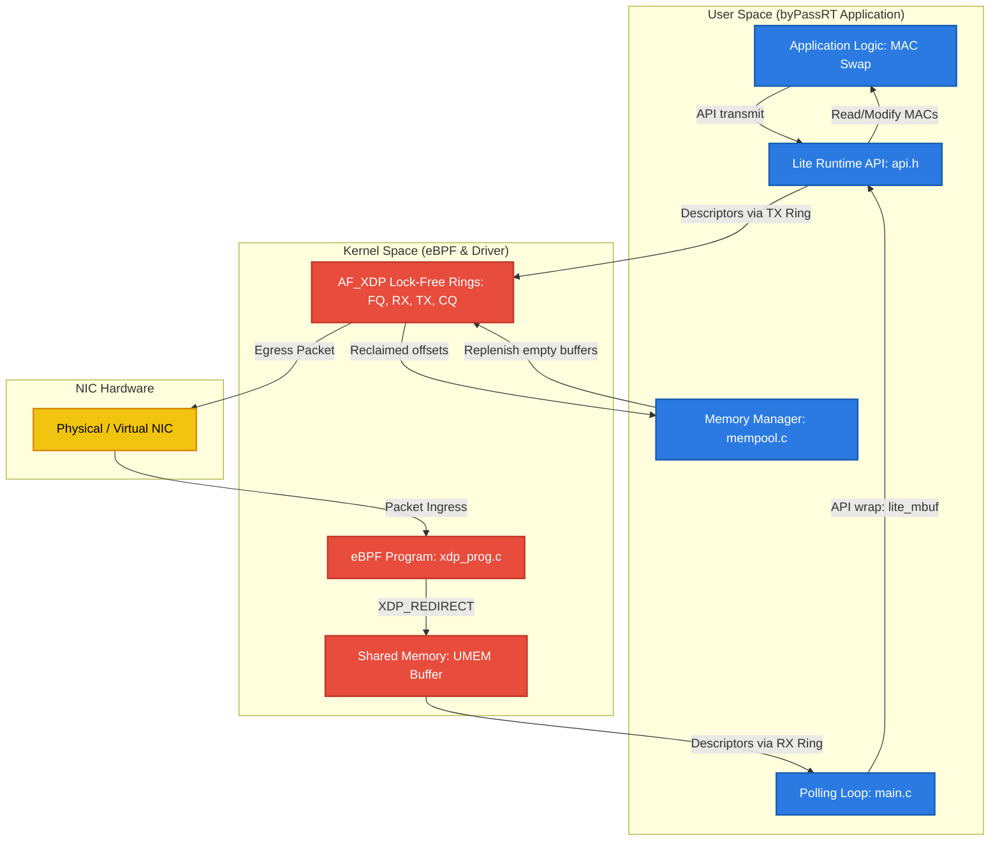
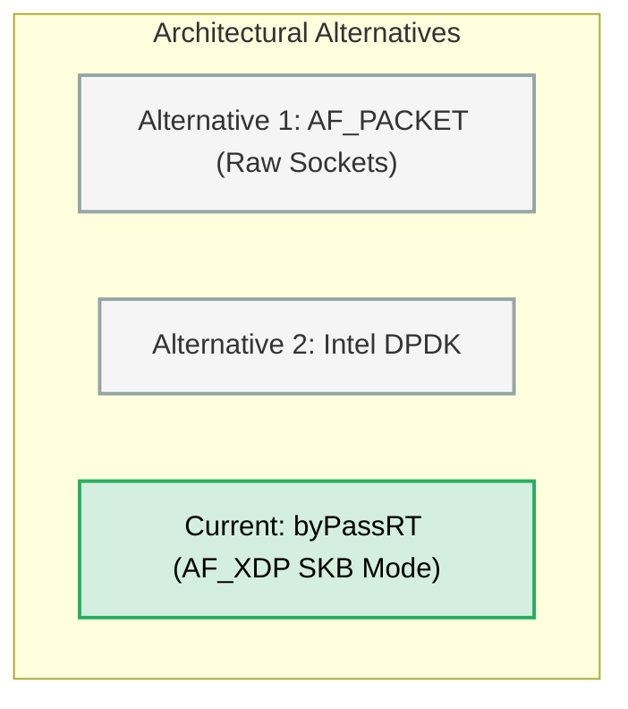

# byPassRT: Architectural & Codebase Master-Class Walkthrough

This document serves as an exhaustive, end-to-end master-class guide to the **byPassRT** project—a lightweight, DPDK-inspired networking runtime written in C using Linux **AF_XDP** and **eBPF** for high-performance user-space packet processing.

---

## Phase 1: The Domain, Problem Space, & Core Solution

### 1. The Core Problem
In traditional operating systems, the network stack is built for fairness, safety, and general-purpose applications. However, at high packet rates (such as in 10Gbps, 40Gbps, or 100Gbps interfaces), the standard Linux kernel network stack encounters severe performance bottlenecks. The key culprits include:
* **Interrupt Storms (IRQ Overhead)**: When packets arrive at the Network Interface Card (NIC), the hardware triggers CPU interrupts. For millions of packets per second (PPS), the CPU spends almost all its time handling context switches and interrupt service routines (`hardirqs` and `softirqs`) instead of executing application logic.
* **Context Switching**: Passing data from kernel space to user space requires crossing the system call boundary (e.g., via `recvfrom`/`sendto`). This invokes CPU context switches, which pollute CPU caches and registers.
* **Dynamic Memory Allocations (`sk_buff` Overhead)**: The Linux kernel wraps every packet in a complex data structure called `sk_buff` (socket buffer). Allocating and deallocating `sk_buff` structures dynamically in memory millions of times per second drains memory bandwidth.
* **Costly Memory Copies**: Standard socket APIs copy packet payloads from the NIC driver's kernel ring buffers into user-space application memory buffers.

### 2. The Antidote: byPassRT
**byPassRT** shifts the packet-processing boundary. Rather than routing packets through the slow kernel protocol stack, it implements a **Kernel Bypass** data plane. It creates a shared memory region (**UMEM**) mapped between the user-space application and the NIC driver, enabling:
* **Zero-Copy I/O**: Packets are written directly by the NIC driver into the UMEM. The user-space C application processes these packets in-place using memory offset pointers, bypassing any kernel-to-user memory copy.
* **Lock-Free Rings**: Communication between kernel space and user space is mediated by single-producer/single-consumer (`SPSC`) ring buffers, avoiding lock contention and kernel mutex overhead.
* **DPDK-Style Mempools**: Dynamic memory allocation (`malloc`/`free`) is completely eliminated from the packet fast-path. It uses pre-allocated static memory buffers (`lite_mbuf`) and stacks of offset indexes.
* **Deterministic Polling Engine**: Instead of waking up on interrupts, a dedicated CPU core spins in a high-speed polling loop, querying the RX rings continuously. This trades idle CPU cycles for sub-microsecond reaction latency.

### 3. Domain Mastery Primer

#### Kernel Bypass
Kernel bypass is a software architecture that allows an application to bypass the operating system kernel network stack and communicate directly with network hardware. This eliminates kernel context switches, protocol overhead (like routing, firewalling, and TCP state tracking), and interrupt latency.

#### eBPF & XDP (eXpress Data Path)
* **eBPF (Extended Berkeley Packet Filter)**: A sandboxed virtual machine inside the Linux kernel that runs verified bytecode at native speed.
* **XDP**: A hook point at the lowest level of the network driver (before `sk_buff` allocation). When a packet arrives, the driver runs an eBPF program which inspects the raw packet metadata and returns a action code:
  * `XDP_PASS`: Pass the packet to the standard Linux TCP/IP stack.
  * `XDP_DROP`: Discard the packet immediately (ideal for hardware-level DDoS protection).
  * `XDP_TX`: Bounce the packet back out of the same NIC interface it arrived on.
  * `XDP_REDIRECT`: Send the packet to another network interface or bypass the kernel by injecting it into an **AF_XDP socket (XSK)**.

#### AF_XDP (Address Family eXpress Data Path)
An address family socket optimized for high-performance packet processing. It maps a user-space memory buffer (**UMEM**) to the kernel. It operates on four lock-free circular queues:
1. **Fill Ring (FQ)**: User-space writes UMEM frame offsets here to notify the kernel where it can place incoming packet data.
2. **RX Ring (RX)**: The kernel writes descriptors (offsets and lengths) of received packets here for user-space to read.
3. **TX Ring (TX)**: User-space writes descriptors of packets it wishes to send here.
4. **Completion Ring (CQ)**: The kernel writes offsets of completed transmissions here, notifying user-space that the memory frames are safe to reclaim.

---

## Phase 2: Architectural Blueprint & Data Flow

### 1. High-Level Architecture
byPassRT separates the network pipeline into the **Control Plane** (handled by Linux utilities/drivers) and the **Data Plane** (processed directly in user space).



### 2. Data & Control Flow (Packet Lifecycle)

```
[Packet Ingress] 
       │
       ▼
 1. NIC Hardware RX Queue
       │
       ▼
 2. XDP Hook executed (xdp_prog.c)
       │
       ▼ [XDP_REDIRECT]
 3. Kernel places payload in UMEM frame & posts offset descriptor to RX Ring
       │
       ▼
 4. Polling loop calls `lite_rx_burst` ───► Peeks RX Ring & maps offset to VM pointer
       │
       ▼
 5. App processes packet (MAC Swap) in-place in UMEM
       │
       ▼
 6. Polling loop calls `lite_tx_burst` ───► Submits offset to TX Ring & triggers kernel TX
       │
       ▼
 7. NIC Hardware transmits packet & Kernel writes offset to Completion Ring
       │
       ▼
 8. `lite_tx_burst` peeks Completion Ring ───► Reclaims offset & pushes it back to Mempool stack
```

### 3. System Dependencies
* **Operating System**: Linux Kernel 4.18+ (Kernel 5.4+ recommended for stable zero-copy performance and eBPF features).
* **Development Headers**:
  * `libbpf-dev`: Standard eBPF utility library.
  * `libxdp-dev`: Helper APIs for loading and attaching eBPF programs to XDP.
  * `libelf-dev` and `zlib1g-dev`: For parsing compiled eBPF ELF binary formats.
* **Network Interfaces**: Support for XDP. For local development, virtual ethernet pairs (`veth`) are utilized as they natively support Generic XDP (SKB Mode).

---

## Phase 3: Directory & File Topology

### 1. Workspace Tree & Explanations

| Path | File Type | Purpose / Structural Role |
| :--- | :--- | :--- |
| **`src/`** | Directory | Core source files implementing the user-space data-plane runtime. |
| ├── `src/main.c` | C Source | Application entry point. Sets up the polling engine runtime loop and implements the L2 MAC address swap reflector. |
| ├── `src/af_xdp.c` | C Source | Direct driver integration. Hooks into `libbpf`/`libxdp` to construct the UMEM, configure the AF_XDP socket, and expose RX/TX burst APIs. |
| └── `src/mempool.c` | C Source | Implementation of the stack-based, lock-free UMEM offset memory manager. |
| **`include/`** | Directory | Header files containing configurations and API interface declarations. |
| ├── `include/api.h` | Header | Defines public structures (`struct lite_mbuf`) and high-level client interfaces (`lite_init`, `lite_rx_burst`, `lite_tx_burst`, `lite_free`). |
| ├── `include/config.h` | Header | Project-wide Constants: defines burst sizes, frame counts, frame dimensions, and UMEM bounds. |
| └── `include/mempool.h` | Header | Defines `struct mempool` and signatures for the UMEM offset allocator. |
| **`xdp/`** | Directory | Source code for the in-kernel eBPF filter program. |
| └── `xdp/xdp_prog.c` | C (eBPF) | Standard eBPF XDP hook program. Passes traffic to the AF_XDP socket or serves as an early drop mechanism. |
| **`tests/`** | Directory | Contain environment provisioning scripts. |
| └── `tests/setup_veth.sh` | Bash Script | Shell commands to spin up virtual ethernet interfaces (`veth-bypass` and `veth-peer`) for isolated local network testing. |
| **`benchmarks/`** | Directory | Benchmarking scripts. |
| └── `benchmarks/run_benchmark.sh` | Bash Script | Triggers high-volume flood pings from the peer interface into byPassRT to validate throughput. |
| **`Makefile`** | Build File | Coordinates compilation of source code, setting include directories, and linking against `libbpf`, `libxdp`, `libelf`, `zlib`, and `pthread`. |
| **`scope_comparison.md`** | Markdown | Compares the AF_XDP runtime design against the original `AF_PACKET` (raw socket) proposal. |
| **`implementation_plan.md`** | Markdown | Defines development milestones, core goals, and the verification roadmap. |
| **`PRESENTATION_GUIDE.md`** | Markdown | Comprehensive presentation outline, pitch talking points, and Q&A strategies. |
| **`slides.md`** | Markdown | Raw slide deck contents for presenting the project. |

---

## Phase 4: Line-by-Line & Block-by-Block Code Walkthrough

### 1. The Polling Engine Entry point: `src/main.c`

#### Signal Handlers & MAC Swapping
```c
static volatile int keep_running = 1;

void handle_signal(int sig) {
    (void)sig;
    keep_running = 0;
}
```
* **Explanation**: Registers signal catches (`SIGINT`, `SIGTERM`) to flip `keep_running` to `0`. `keep_running` is declared `volatile` to prevent the compiler from optimizing it into a CPU register, ensuring that the polling loop reads its value from memory on every iteration.

```c
static void swap_mac(uint8_t *data) {
    uint8_t tmp[6];
    memcpy(tmp, data, 6);
    memcpy(data, data + 6, 6);
    memcpy(data + 6, tmp, 6);
}
```
* **Explanation**: Swaps the source and destination MAC addresses of an incoming Ethernet frame in-place. The first 6 bytes of `data` are the Destination MAC, and the next 6 bytes are the Source MAC. Swapping them prepares the packet to be routed back to the sender.

#### The Polling Loop
```c
int main(int argc, char *argv[]) {
    // ... Command validation and signal registration ...
    const char *ifname = argv[1];

    if (lite_init(ifname) < 0) {
        fprintf(stderr, "Failed to initialize AF_XDP backend\n");
        return EXIT_FAILURE;
    }

    struct lite_mbuf *pkts[BURST_SIZE];
    uint64_t total_rx = 0;
    uint64_t total_tx = 0;
```
* **Explanation**: Takes the network interface name as a command-line argument, initializes the AF_XDP backend via `lite_init(ifname)`, and allocates an array of `struct lite_mbuf *` pointers of size `BURST_SIZE` (32) on the stack to hold packet bursts.

```c
    while (keep_running) {
        int rcvd = lite_rx_burst(pkts, BURST_SIZE);
        if (rcvd > 0) {
            total_rx += rcvd;

            for (int i = 0; i < rcvd; i++) {
                if (pkts[i]->data_len >= 14) { // Minimum Ethernet frame
                    swap_mac(pkts[i]->data);
                }
            }

            int sent = lite_tx_burst(pkts, rcvd);
            total_tx += sent;

            for (int i = sent; i < rcvd; i++) {
                lite_free(pkts[i]);
            }
            // ... Print telemetry stats ...
        }
    }
```
* **Explanation**:
  1. Calls `lite_rx_burst` to poll the RX ring and retrieve up to `BURST_SIZE` packets.
  2. If packets are received, it iterates through them. If the length is at least 14 bytes (size of an Ethernet header), it swaps the MAC addresses.
  3. It attempts to transmit the entire received burst back out via `lite_tx_burst`.
  4. If `lite_tx_burst` fails to transmit all packets (i.e., `sent < rcvd` because the TX ring was full), the remaining unsent packets (from index `sent` to `rcvd - 1`) are freed using `lite_free` to prevent UMEM leaks.

---

### 2. The AF_XDP Core Backend: `src/af_xdp.c`

#### Structures & Memory Mappings
```c
struct xsk_umem_info
{
    struct xsk_ring_prod fq; // Fill Ring (Producer: App, Consumer: Kernel)
    struct xsk_ring_cons cq; // Completion Ring (Consumer: App, Producer: Kernel)
    struct xsk_umem *umem;
    void *buffer;
};

struct xsk_socket_info
{
    struct xsk_ring_cons rx; // RX Ring (Consumer: App, Producer: Kernel)
    struct xsk_ring_prod tx; // TX Ring (Producer: App, Consumer: Kernel)
    struct xsk_umem_info *umem;
    struct xsk_socket *xsk;
};
```
* **Explanation**: These structures wrap the rings and configurations for both the Shared UMEM region and the AF_XDP Socket. Notice that rings are classified as `xsk_ring_prod` (for producing descriptors) and `xsk_ring_cons` (for consuming descriptors).

#### Bootstrapping the UMEM
```c
static struct xsk_umem_info *configure_xsk_umem(void *buffer, uint64_t size)
{
    struct xsk_umem_info *umem;
    int ret;

    umem = calloc(1, sizeof(*umem));
    if (!umem)
        return NULL;

    ret = xsk_umem__create(&umem->umem, buffer, size, &umem->fq, &umem->cq, NULL);
    if (ret)
    {
        fprintf(stderr, "Error: xsk_umem__create failed: %s\n", strerror(-ret));
        free(umem);
        return NULL;
    }
    umem->buffer = buffer;
    return umem;
}
```
* **Explanation**: Leverages the libbpf helper `xsk_umem__create` to register the allocated virtual memory buffer with the kernel as a shared UMEM region. It binds this UMEM region to the Fill Ring (`fq`) and Completion Ring (`cq`).

#### Creating and Binding the Socket
```c
static struct xsk_socket_info *xsk_configure_socket(struct xsk_umem_info *umem, const char *ifname, uint32_t queue_id)
{
    // ... Struct setups ...
    xsk_cfg.rx_size = XSK_RING_CONS__DEFAULT_NUM_DESCS; // default: 2048
    xsk_cfg.tx_size = XSK_RING_PROD__DEFAULT_NUM_DESCS; // default: 2048
    xsk_cfg.libbpf_flags = 0;
    xsk_cfg.xdp_flags = XDP_FLAGS_SKB_MODE; // Use SKB mode for compatibility/testing
    xsk_cfg.bind_flags = 0;

    ret = xsk_socket__create(&xsk_info->xsk, ifname, queue_id, umem->umem, &xsk_info->rx, &xsk_info->tx, &xsk_cfg);
    // ...
```
* **Explanation**: Creates the AF_XDP socket using `xsk_socket__create`. 
  * `queue_id` is set to 0. We configure it to bind to queue 0 of the NIC interface.
  * `XDP_FLAGS_SKB_MODE` (Generic XDP / SKB Mode) is set. This directs the driver to run XDP logic inside generic kernel networking code after packet ingestion. It is highly compatible, working on virtual interfaces (like `veth`) without requiring specific hardware driver support.

```c
    // Populate fill ring
    ret = xsk_ring_prod__reserve(&umem->fq, XSK_RING_PROD__DEFAULT_NUM_DESCS, &idx);
    if (ret != XSK_RING_PROD__DEFAULT_NUM_DESCS) { ... }
    
    for (int i = 0; i < XSK_RING_PROD__DEFAULT_NUM_DESCS; i++)
    {
        bool success;
        uint32_t offset = mempool_alloc(g_mempool, &success);
        if (!success) { ... }
        *xsk_ring_prod__fill_addr(&umem->fq, idx++) = offset;
    }
    xsk_ring_prod__submit(&umem->fq, XSK_RING_PROD__DEFAULT_NUM_DESCS);

    return xsk_info;
}
```
* **Explanation**: Before the socket can receive any traffic, we must supply the kernel with empty memory locations.
  1. We reserve 2048 slots (`XSK_RING_PROD__DEFAULT_NUM_DESCS`) in the Fill Ring using `xsk_ring_prod__reserve`.
  2. For each slot, we call `mempool_alloc` to obtain a frame offset in the UMEM.
  3. We write the offset into the Fill Ring memory using `xsk_ring_prod__fill_addr`.
  4. Finally, we execute `xsk_ring_prod__submit` to update the ring tail pointer in kernel-space, alerting the driver that these slots are ready.

#### Initializing the Backend
```c
int lite_init(const char *ifname)
{
    void *bufs;

    // Allocate UMEM buffer
    if (posix_memalign(&bufs, getpagesize(), UMEM_SIZE))
    {
        fprintf(stderr, "Error: Could not allocate UMEM buffer\n");
        return -1;
    }

    g_mempool = mempool_init(NUM_FRAMES, FRAME_SIZE);
    // ...
```
* **Explanation**:
  1. Uses `posix_memalign` to allocate UMEM memory aligned to the OS page size. Page alignment is a hard requirement for AF_XDP UMEM registration because the kernel maps this memory using the CPU's MMU page tables.
  2. Initializes `g_mempool` with 4096 frames (`NUM_FRAMES`), each 2048 bytes in size (`FRAME_SIZE`), mapping exactly to the 8MB `UMEM_SIZE`.
  3. Registers this memory buffer with the kernel as UMEM and configures the socket.

#### Ingress Core: `lite_rx_burst`
```c
int lite_rx_burst(struct lite_mbuf **pkts, int max)
{
    uint32_t idx_rx;
    int rcvd;

    if (!g_xsk)
        return 0;

    rcvd = xsk_ring_cons__peek(&g_xsk->rx, max, &idx_rx);
    if (!rcvd)
        return 0;
```
* **Explanation**: Calls `xsk_ring_cons__peek` to check if the kernel has posted new received packets to the RX Ring. It returns the number of received packets (up to `max`) and sets `idx_rx` to the start index in the ring.

```c
    for (int i = 0; i < rcvd; i++)
    {
        const struct xdp_desc *desc = xsk_ring_cons__rx_desc(&g_xsk->rx, idx_rx++);
        struct lite_mbuf *pkt = malloc(sizeof(struct lite_mbuf)); 
        if (!pkt)
            continue;

        uint64_t addr = desc->addr;
        uint32_t len = desc->len;

        // Obtain actual pointer into memory using offset
        pkt->data = (uint8_t *)g_xsk->umem->buffer + addr;
        pkt->data_len = len;
        pkt->buf_len = FRAME_SIZE;
        pkt->timestamp = 0;

        pkts[i] = pkt;
    }
    xsk_ring_cons__release(&g_xsk->rx, rcvd);
```
* **Explanation**: 
  1. For each descriptor (`xdp_desc`) in the ring, we extract the UMEM relative `addr` (offset) and the packet byte `len`.
  2. We allocate a small user-space metadata tracker `struct lite_mbuf` on the heap.
  3. We map the offset to a virtual memory address: `umem->buffer + addr` (simple pointer arithmetic) and save it in `pkt->data`. No packet payload copy occurs!
  4. Once parsed, `xsk_ring_cons__release` updates the RX consumer pointer, telling the kernel that we have read the RX descriptors.

```c
    // Replenish the fill ring with fresh buffers from mempool immediately
    uint32_t idx_fq;
    int ret = xsk_ring_prod__reserve(&g_xsk->umem->fq, rcvd, &idx_fq);
    while (ret != rcvd)
    {
        if (ret < 0)
            break;
        ret = xsk_ring_prod__reserve(&g_xsk->umem->fq, rcvd, &idx_fq);
    }
    if (ret == rcvd)
    {
        for (int i = 0; i < rcvd; i++)
        {
            bool success;
            uint32_t offset = mempool_alloc(g_mempool, &success);
            if (success)
            {
                *xsk_ring_prod__fill_addr(&g_xsk->umem->fq, idx_fq++) = offset;
            }
        }
        xsk_ring_prod__submit(&g_xsk->umem->fq, rcvd);
    }

    return rcvd;
}
```
* **Explanation**: Every packet received consumes an empty UMEM buffer. To prevent hardware buffer starvation, we must replenish the Fill Ring immediately with fresh, empty offsets popped from our `g_mempool`. We reserve `rcvd` slots in the Fill Ring and write the new offsets, then submit.

#### Egress Core: `lite_tx_burst`
```c
int lite_tx_burst(struct lite_mbuf **pkts, int count)
{
    uint32_t tx_idx;
    int sent = 0;

    if (!g_xsk || count == 0)
        return 0;

    // Reserve TX slots
    sent = xsk_ring_prod__reserve(&g_xsk->tx, count, &tx_idx);
    if (sent == 0)
        return 0;

    for (int i = 0; i < sent; i++)
    {
        struct xdp_desc *desc = xsk_ring_prod__tx_desc(&g_xsk->tx, tx_idx++);
        // Determine offset from UMEM pointer
        uint64_t offset = (uint8_t *)pkts[i]->data - (uint8_t *)g_xsk->umem->buffer;

        desc->addr = offset;
        desc->len = pkts[i]->data_len;

        // Free the user-space metadata, as the packet is now owned by TX ring
        free(pkts[i]);
    }
    xsk_ring_prod__submit(&g_xsk->tx, sent);
```
* **Explanation**:
  1. We reserve `count` descriptors in the TX ring.
  2. For each packet, we reverse-engineer the UMEM relative offset by subtracting the UMEM buffer base address from the packet's data pointer: `pkts[i]->data - g_xsk->umem->buffer`.
  3. We write this offset (`desc->addr`) and length into the TX ring descriptor.
  4. The user-space metadata `pkts[i]` is freed via `free(pkts[i])` since the kernel now owns the frame buffer.
  5. `xsk_ring_prod__submit` signals the kernel to transmit the packets out of the network interface.

```c
    // Process completion ring
    uint32_t cq_idx;
    int completed = xsk_ring_cons__peek(&g_xsk->umem->cq, XSK_RING_CONS__DEFAULT_NUM_DESCS, &cq_idx);
    if (completed > 0)
    {
        for (int i = 0; i < completed; i++)
        {
            uint64_t addr = *xsk_ring_cons__comp_addr(&g_xsk->umem->cq, cq_idx++);
            mempool_free(g_mempool, addr);
        }
        xsk_ring_cons__release(&g_xsk->umem->cq, completed);
    }

    return sent;
}
```
* **Explanation**: Once the NIC driver finishes transmitting a packet, it pushes the transmitted UMEM offset to the Completion Ring.
  1. We call `xsk_ring_cons__peek` on the Completion Ring (`cq`).
  2. For each completed descriptor, we extract the UMEM address (`addr`) and call `mempool_free(g_mempool, addr)` to return this frame offset to the free stack.
  3. We call `xsk_ring_cons__release` to clean up the Completion Ring.

#### Memory Reclamation: `lite_free`
```c
void lite_free(struct lite_mbuf *pkt)
{
    if (!pkt)
        return;
    if (g_xsk && g_xsk->umem && g_mempool)
    {
        uint64_t offset = (uint8_t *)pkt->data - (uint8_t *)g_xsk->umem->buffer;
        mempool_free(g_mempool, offset);
    }
    free(pkt);
}
```
* **Explanation**: Reclaims a buffer that was received but was not transmitted. It calculates the UMEM relative offset, returns the offset to `g_mempool`, and frees the user-space metadata structure.

---

### 3. The Memory Manager: `src/mempool.c`

```c
struct mempool *mempool_init(uint32_t num_frames, uint32_t frame_size) {
    struct mempool *mp = calloc(1, sizeof(struct mempool));
    if (!mp) return NULL;

    mp->free_stack = calloc(num_frames, sizeof(uint32_t));
    if (!mp->free_stack) {
        free(mp);
        return NULL;
    }

    mp->capacity = num_frames;
    mp->head = num_frames;

    // Fill stack with all available offsets
    for (uint32_t i = 0; i < num_frames; i++) {
        mp->free_stack[i] = i * frame_size;
    }

    return mp;
}
```
* **Explanation**: Allocates a stack containing `num_frames` indices. It precomputes the relative offsets (`i * frame_size`) for every single frame inside the UMEM and pushes them onto the `free_stack`. The stack's `head` pointer is initialized to `num_frames`, meaning the stack is full (all frames are available).

```c
uint32_t mempool_alloc(struct mempool *mp, bool *success) {
    if (mp->head == 0) {
        *success = false;
        return 0;
    }
    *success = true;
    mp->head--;
    return mp->free_stack[mp->head];
}

void mempool_free(struct mempool *mp, uint32_t offset) {
    if (mp->head < mp->capacity) {
        mp->free_stack[mp->head] = offset;
        mp->head++;
    } else {
        fprintf(stderr, "Mempool capacity exceeded (double free?)\n");
    }
}
```
* **Explanation**: 
  * `mempool_alloc` pops the top offset from the stack by decrementing `head` and returning `free_stack[head]`. This executes in $O(1)$ constant time with zero system calls.
  * `mempool_free` pushes an offset back to the stack by writing to `free_stack[head]` and incrementing `head`. It prevents memory exhaustion or corruption by checking that the stack does not exceed its capacity (safeguard against double frees).

---

### 4. The eBPF Redirect Hook: `xdp/xdp_prog.c`

```c
#include <linux/bpf.h>
#include <bpf/bpf_helpers.h>

SEC("xdp")
int custom_xdp_prog(struct xdp_md *ctx) {
    // Example: Pass everything to the AF_XDP socket.
    return XDP_PASS;
}

char _license[] SEC("license") = "GPL";
```
* **Explanation**:
  * `SEC("xdp")`: A BPF section definition telling the eBPF loader (`libbpf`) that this function is an XDP program.
  * `struct xdp_md *ctx`: Contains context about the received packet (start pointer, end pointer, metadata).
  * `return XDP_PASS;`: Passes all incoming packets to the standard kernel path.
  * *Important Note*: In this implementation, the `libbpf` socket binding process implicitly attaches a built-in kernel redirect helper program to the interface. The `xdp_prog.c` here acts as a sandbox for custom packet filtering.

---

## Phase 5: Design Choices, Trade-offs, & Alternatives

### 1. Software Design Patterns
* **SPSC (Single Producer Single Consumer) Lock-Free Rings**: The core AF_XDP backend uses ring buffers. One thread (e.g., the user-space polling engine) writes to TX, and another entity (the NIC driver/kernel) reads. This lock-free coordination operates via atomic read and write pointers, eliminating mutex lock overhead.
* **Singleton (Global State)**: The project maintains a single static network configuration instance `g_xsk` and a single static allocator `g_mempool` in `af_xdp.c`. This simple design avoids passing handles through the codebase, optimizing execution path length.
* **Mempool Resource Allocation**: Implements a dedicated allocator pattern. The system claims all required memory up-front, decoupling memory management from the OS virtual memory manager at runtime.

### 2. Design Trade-offs & Decisions

#### trade-off 1: SKB Mode (`XDP_FLAGS_SKB_MODE`) vs Native Driver Mode (`XDP_FLAGS_DRV_MODE`)
* **Chosen approach**: SKB Mode (Generic XDP).
* **Rationale**: Generic XDP is implemented inside the kernel's network layer. It copies packet payloads and does not require custom NIC driver support. While it is slower than Native Driver Mode, it is fully compatible with virtual interfaces (like `veth`), making it ideal for development and testing on any Linux VM.
* **Trade-off**: Lower peak performance (due to memory copy in kernel space) in exchange for 100% hardware compatibility.

#### trade-off 2: Dynamic heap allocations in `lite_rx_burst`
* **Chosen approach**: `struct lite_mbuf *pkt = malloc(sizeof(struct lite_mbuf));`
* **Rationale**: Allocating the metadata wrapper (`lite_mbuf`) on the heap for every packet in the RX burst simplifies API design.
* **Trade-off**: Dynamic allocations in the fast path limit peak performance. In an optimal production configuration, the `lite_mbuf` structures themselves should be pre-allocated inside the UMEM or stored in a secondary user-space ring buffer.

#### trade-off 3: Single-Threaded Polling Loop
* **Chosen approach**: Single loop running in `main.c`.
* **Rationale**: Single-threaded execution avoids inter-core synchronization, thread contention, and cache bouncing, maximizing performance for a single queue.
* **Trade-off**: The application is limited to a single CPU core's capacity. Scaling to handle multi-queue NICs requires building a multi-threaded system.

---

### 3. Alternative Architecture Analysis



#### Alternative 1: Traditional Raw Sockets (`AF_PACKET`)
* **Description**: Reading packets via traditional raw Linux sockets using standard `recvfrom()`.
* **Pros**: Simple to code; requires no special kernel configurations or eBPF libraries.
* **Cons**: Extremely high latency. The kernel must allocate an `sk_buff` for every packet, route it through iptables/filters, copy the payload to user-space, and perform a full context switch.
* **Verdict**: Collapses under heavy packet traffic.

#### Alternative 2: Intel DPDK (Data Plane Development Kit)
* **Description**: Using DPDK Poll Mode Drivers (PMD) to bind directly to physical NIC hardware.
* **Pros**: Ultimate performance. True hardware-level zero-copy.
* **Cons**: High complexity. DPDK requires taking the NIC completely off the Linux bus (unbinding the standard driver). As a result, standard Linux networking tools (SSH, `ping`, `ifconfig`, routing) cease to function on that interface.
* **Verdict**: Overkill for development or mixed-purpose setups; requires specialized hardware.

#### Alternative 3: Multi-Queue RSS Worker Model
* **Description**: Scaling byPassRT to run multiple threads, with each thread pinned to a dedicated CPU core and polling its own AF_XDP socket bound to a unique NIC hardware queue (via RSS - Receive Side Scaling).
* **Pros**: Scalable. Fully utilizes multi-core servers to process tens of millions of packets per second.
* **Cons**: High architectural complexity. Requires handling cross-thread synchronization and NUMA (Non-Uniform Memory Access) memory locality issues.
* **Verdict**: The natural next step for scaling the application.

---

## Phase 6: Operational Runbook & Mastery Check

### 1. Execution Lifecycle

#### Step 1: Bootstrapping & Memory Allocation
1. The application starts (`sudo ./byPassRT veth-bypass`).
2. Calls `posix_memalign` to allocate page-aligned virtual memory for UMEM.
3. Initializes the `mempool` stack, loading all frame offsets.
4. Registers the UMEM buffer with the kernel via `xsk_umem__create`.

#### Step 2: Binding & Initialization
1. Creates the socket via `xsk_socket__create` and binds to queue `0` on the specified interface in SKB mode.
2. The library automatically loads the default redirect helper program onto the interface's XDP hook.
3. User-space allocates buffers from the mempool and fills the Fill Ring (FQ) to start receiving packets.

#### Step 3: Polling Loop
1. The polling loop enters its active spin.
2. Querying `lite_rx_burst` peeks the RX ring.
3. Incoming packet descriptors are mapped to UMEM addresses.
4. The application processes the data, submits the offsets to the TX ring, and triggers transmission.
5. The Completion Ring (CQ) is polled, reclaiming offsets back to the mempool.

#### Step 4: Graceful Shutdown
1. Upon receiving `SIGINT` or `SIGTERM`, `keep_running` is set to `0`.
2. The polling loop exits.
3. The socket and UMEM structures are destroyed, releasing resources back to the OS.

---

### 2. Validation & Testing

#### Setting up the Virtual Environment
To test the runtime locally without losing SSH or internet access:
```bash
# 1. Create a virtual ethernet pair (veth-bypass <---> veth-peer)
chmod +x tests/setup_veth.sh
./tests/setup_veth.sh

# 2. Configure the peer interface with an IP address
sudo ip addr add 10.0.0.1/24 dev veth-peer
```

#### The Static Neighbor Fix (Crucial)
Because byPassRT operates purely at Layer 2 (Raw Ethernet) and does not run an ARP resolution daemon, sending standard Layer 3 IP traffic (like `ping`) will block. The sending OS will broadcast ARP requests looking for `10.0.0.2`, which byPassRT does not answer. To bypass this, add a static ARP entry in the host's neighbor table:
```bash
sudo ip neigh add 10.0.0.2 lladdr 02:02:02:02:02:02 dev veth-peer
```
This forces the host to wrap packets destined for `10.0.0.2` in an Ethernet frame with the destination MAC `02:02:02:02:02:02` immediately, bypassing ARP.

#### Running the Runtime
```bash
sudo ./byPassRT veth-bypass
```

#### Stress Testing (Flood Ping)
In another terminal, run a flood ping to send packets as fast as possible:
```bash
sudo ping -q -f -c 100000 10.0.0.2 -I veth-peer
```
This blasts 100,000 ICMP packets into `veth-peer`. The packets cross the virtual wire to `veth-bypass`, get intercepted by byPassRT, have their MAC addresses swapped, and are bounced back. You will see the telemetry count updating instantly.

---

### 3. Future Extension & Scaling Roadmap

#### Bottleneck 1: Dynamic Allocation in the Ingress Path
* **Location**: `src/af_xdp.c` inside `lite_rx_burst`.
```c
struct lite_mbuf *pkt = malloc(sizeof(struct lite_mbuf));
```
* **Solution**: Pre-allocate the metadata structures. For instance, store them directly at the beginning of each UMEM frame (by adjusting frame headroom/offsets) or pre-allocate a fixed pool of `struct lite_mbuf` structures during startup.

#### Bottleneck 2: Single-Thread/Single-Queue Limit
* **Location**: `main.c` polling loop.
* **Solution**:
  1. Determine the number of CPU cores and NIC RX/TX queues.
  2. Spawn one polling thread per core.
  3. Create an AF_XDP socket per thread and bind each to a separate queue ID (`queue_id = 0, 1, 2...`).
  4. Enable Receive Side Scaling (RSS) on the NIC to automatically hash incoming packets across the hardware queues.

#### Feature Extension: early-stage eBPF DDoS Protection Shield
* **Location**: `xdp/xdp_prog.c`.
* **Implementation**: Edit `custom_xdp_prog` to parse the packet header in kernel-space before it reaches user-space:
```c
SEC("xdp")
int custom_xdp_prog(struct xdp_md *ctx) {
    void *data_end = (void *)(long)ctx->data_end;
    void *data = (void *)(long)ctx->data;
    
    // Parse Ethernet header
    struct ethhdr *eth = data;
    if ((void *)(eth + 1) > data_end)
        return XDP_PASS;
        
    // Parse IP header
    if (eth->h_proto == htons(ETH_P_IP)) {
        struct iphdr *iph = (void *)(eth + 1);
        if ((void *)(iph + 1) > data_end)
            return XDP_PASS;
            
        // Drop packets from a blocked IP address
        if (iph->saddr == htonl(0x0A00000A)) { // 10.0.0.10
            return XDP_DROP;
        }
    }
    return XDP_PASS;
}
```
This drops matching packets instantly in the driver, protecting user-space from resource exhaustion.
