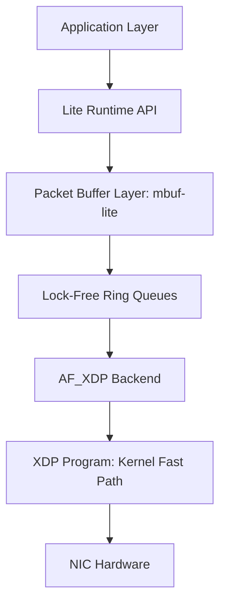

# Implementation Plan - byPassRT

A lightweight user-space packet processing runtime inspired by DPDK, leveraging AF_XDP/XDP for high-performance kernel bypass.

## Goals
- Build a mini kernel-bypass runtime.
- Process packets in user space with minimal latency and high throughput.
- Implement core data-plane abstractions: `mbuf`, `mempool`, and lock-free rings.

## Proposed Architecture

## Proposed Changes

### [NEW] Project Structure
- `src/`: Core implementation files (`af_xdp.c`, `mbuf.c`, `mempool.c`, `ring.c`, `poller.c`).
- `include/`: Header files defining the internal and public APIs.
- `xdp/`: eBPF/XDP program source.
- `tests/`: Unit tests and functional validation.
- `benchmarks/`: Performance measurement scripts and baseline socket implementations.

### [NEW] Core Components

#### AF_XDP Backend
- Responsible for socket creation (`xsk_socket__create`).
- UMEM management (registration, mapping).
- Ring management (RX, TX, Fill, Completion).

#### Packet Buffer System (`mbuf-lite`)
- Preallocated memory blocks to avoid dynamic allocation in the fast path.
- `lite_mbuf` structure containing data pointer, length, and metadata.

#### Lock-Free Ring Buffers
- SPSC (Single Producer Single Consumer) rings for zero-contention communication between the poll engine and the application.

#### Polling Engine
- Main execution loop using a "burst" (batch) processing model.
- Polling-based I/O instead of interrupt-driven I/O.

## Development Phases

### Phase 1: AF_XDP Foundation
- **Goal**: Establish a working "echo" or loopback using AF_XDP.
- **Complexity**: High (requires understanding AF_XDP UMEM and ring mechanics).

### Phase 2: Memory Management
- **Goal**: Replace raw UMEM pointers with a structured `mbuf` system and `mempool` allocator.
- **Complexity**: Medium.

### Phase 3: Runtime & API
- **Goal**: Abstract the backend into a clean API that looks like a "mini-DPDK".
- **Complexity**: Medium.

### Phase 4: Optimization
- **Goal**: Add XDP filtering, CPU affinity, and zero-copy support.
- **Complexity**: Medium.

## Verification Plan

### Performance Benchmarking
- **Throughput**: Measured in Packets Per Second (PPS) using `iperf3` or custom traffic generators.
- **Latency**: Measured using round-trip time (RTT) for small packets.
- **Baseline**: Comparison against standard Linux `AF_INET` and `AF_PACKET` sockets.

### Functional Testing
- **Loopback Test**: Verified by sending packets to the NIC and receiving them back.
- **Batching Test**: Verify that the burst API correctly handles varying numbers of packets.
